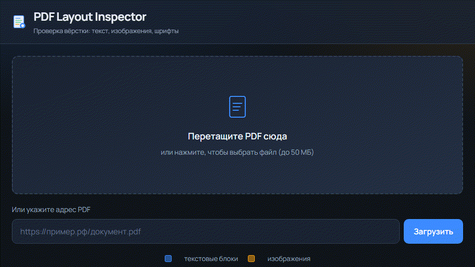
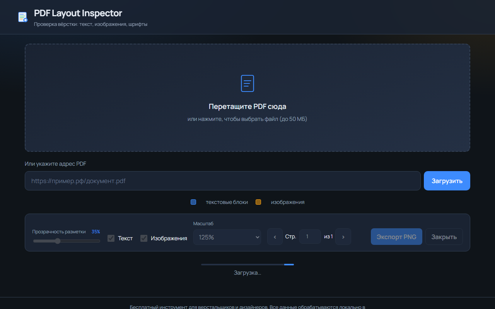
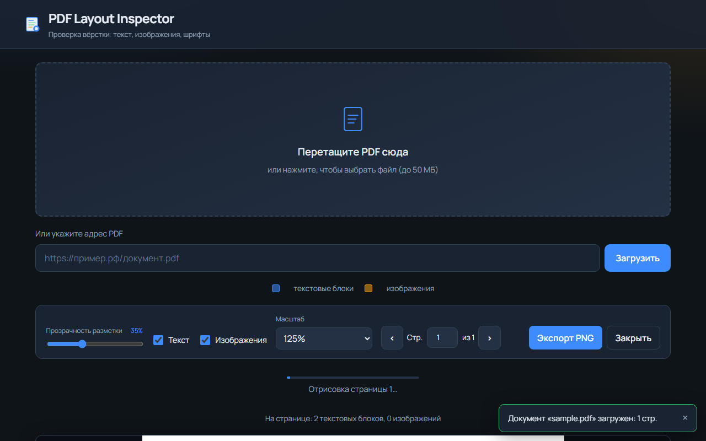
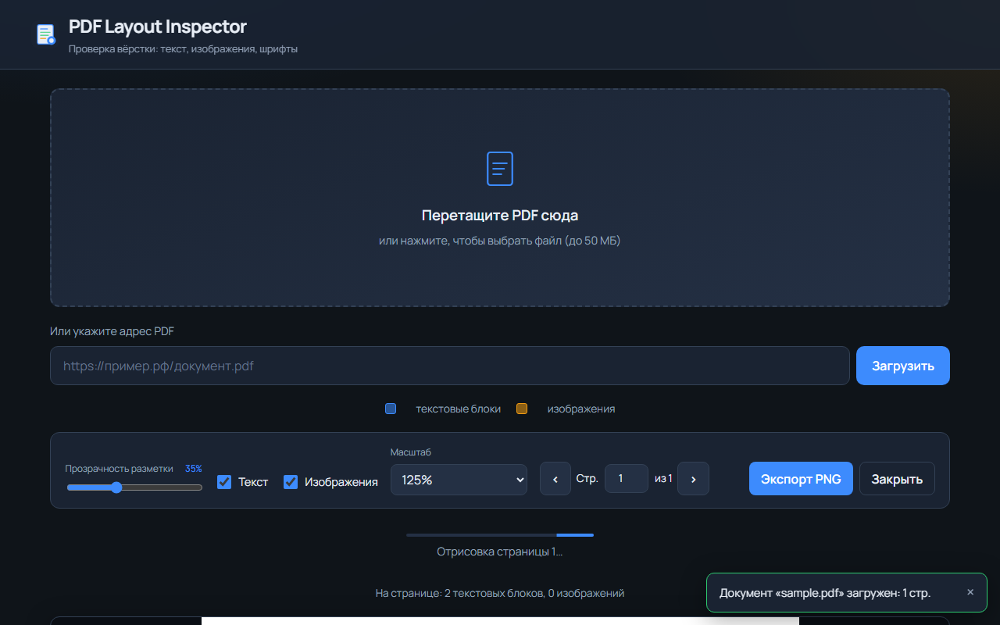
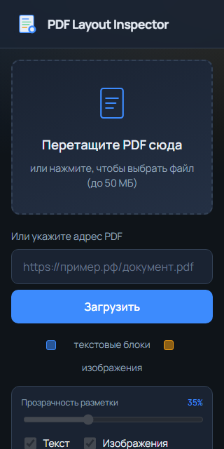

# PDF Layout Inspector

Бесплатный инструмент для верстальщиков и дизайнеров: загрузите PDF и сразу увидите все текстовые блоки и изображения, обведённые цветными рамками. Проверьте, ровно ли стоит текст и не «улетела» ли вёрстка.



## Возможности

- Загрузка PDF через **pdf.js** (файл или URL)
- Рендеринг страниц на **Canvas**
- Полупрозрачные оверлеи текстовых блоков и изображений
- Слайдер **«Прозрачность разметки»**
- Экспорт **карты блоков** в PNG (через OffscreenCanvas)
- **Лупа** при наведении: семейство и размер шрифта
- Режим **«Линейка»** — измерение расстояний (px / pt / мм)
- Страница **«Мульти-файл»** — наложение PDF и картинки слоями
- Обработка разметки в **Web Worker**
- Полностью на русском языке, без бэкенда и API-ключей





## Быстрый старт

```bash
npm install
npm run dev
```

Откройте в браузере адрес, который покажет Vite (обычно `http://localhost:18765`).

Сборка production:

```bash
npm run build
npm run preview
```

## GitHub Pages

Сайт: https://abudkina.github.io/pdf-layout-inspector/

Публикуется ветка `gh-pages` (production-сборка Vite). Исходники из `main` на Pages не открываются.

Обновить сайт после изменений:

```bash
VITE_BASE_PATH=/pdf-layout-inspector/ npm run build
npx gh-pages -d dist
```

На Windows (PowerShell):

```powershell
$env:VITE_BASE_PATH="/pdf-layout-inspector/"; npm run build; npx gh-pages -d dist
```

## Тесты

```bash
# Юнит-тесты
npm test

# E2E (Playwright)
npx playwright install chromium
npm run test:e2e

# Все сразу
npm run test:all
```

## Как пользоваться

1. Перетащите PDF в зону загрузки или выберите файл (до 50 МБ).
2. Дождитесь отрисовки страницы и цветных рамок.
3. Наведите курсор на текстовый блок — появится лупа с метриками шрифта.
4. Настройте прозрачность и масштаб.
5. Нажмите **«Экспорт PNG»**, чтобы сохранить карту блоков.

| Цвет рамки | Тип блока   |
| ---------- | ----------- |
| Синий      | Текст       |
| Оранжевый  | Изображения |





## Стек

- Vite + TypeScript
- pdf.js (Mozilla)
- Canvas API / OffscreenCanvas
- Web Workers
- Vitest + Playwright

## Структура проекта

```
src/
  app/           — корневое приложение
  components/    — UI (загрузка, панель, просмотр, лупа)
  services/      — PDF, рендер, экспорт, воркер-клиент
  workers/       — постобработка разметки
  utils/         — валидация, геометрия, хранилище, логгер
  styles/        — стили (mobile-first)
tests/
  unit/          — юнит-тесты
  e2e/           — сценарии Playwright
  fixtures/      — образец PDF
docs/screenshots — скриншоты и GIF-демка
```

## Конфиденциальность

Все данные обрабатываются **только в браузере**. Файлы не отправляются на сервер. Настройки хранятся в LocalStorage.

## Лицензия

MIT
